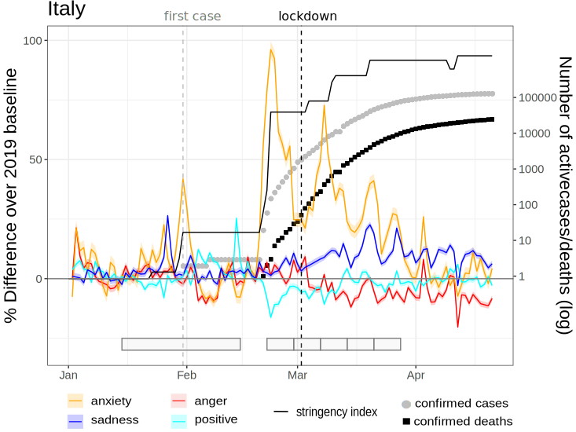
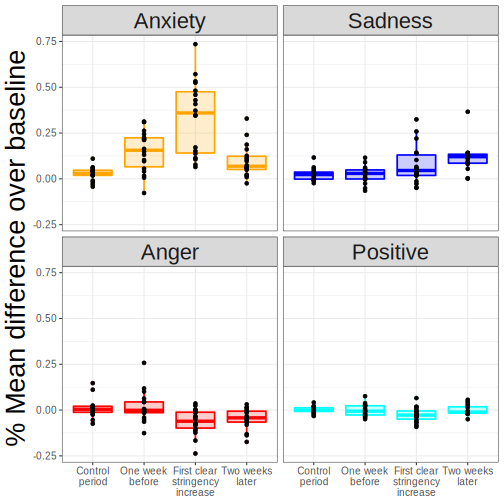
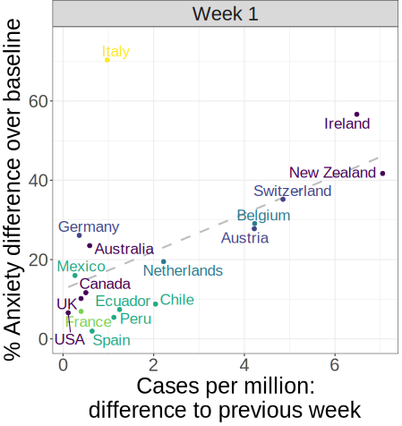

```{r xaringan-themer, include=FALSE, warning=FALSE}
# #This block contains the theme configuration for the CSS lab slides style
library(xaringanthemer)
library(showtext)
style_mono_accent(
  base_color = "#1f5c99",
  text_font_size = "1.5rem",
  header_font_google = google_font("Raleway"),#("Yanone Kaffeesatz"),
  text_font_google   = google_font("Arial", "300", "300i"),
  code_font_google   = google_font("Fira Mono")
)
```

```{r setup, include=FALSE}
options(htmltools.dir.version = FALSE)
```

layout: true

---
class: inverse, center, middle, title-slide
background-image: url(figures/brain.png)
background-size: contain

# The Role of Emotions in Digital Communication
## Research lecture for the Assistant Professor Position on *Digital Technologies and Psychology*
### Mag. Dr. Hannah Metzler
### 09.09.2021

---

# Emotions and Social Factors in Non-Verbal Social Interaction

.pull-left[
- Emotions direct attention 
- Emotions determine relevance

Schema:

* Stimulus - Perceiver
* Perceived/expressed emotion - felt emotion
]

```{r, echo=FALSE, out.width=925}
# knitr::include_graphics("figures/Lab-July2021.png")
```

<!-- ```{r, echo=FALSE, out.width=900} -->
<!-- knitr::include_graphics("figures/Hype1.svg") -->
<!-- ``` -->

???

face in the crowd picture?
fear averted gaze picture?

---

# Emotions in Digital Communication
.left-column[
**Social media...**

As a **tool**

<br>
Their **effects**

<br>
As **environments**
]
--
<br>
.right-column[

* Tracking collective emotions during COVID-19
* Validity of social media sentiment measures <br> <br>
* Effects of media content on mental health, <br> e.g. suicidal behavior <br> <br>
* Behavior on social media: <br>
Misinformation spreading & advocacy for societal causes 
]

???
* Collective emotions during the COVID-19 outbreak
  * Mental health: Suicide
  * Socio-emotional effects on 
      - misinformation spreading 
      - advocacy for societal causes
covid emotions picture
suicide tweets picture

---


---
layout: true
<div class="my-footer"><span>
<a href="https://psyarxiv.com/qejxv"> Collective Emotions During the COVID-19 Outbreak. Metzler, Rimé, Pellert, Niederkrotenthaler, Di Natale & Garcia. Psyarxiv (2021)</a></span></div>

---

# Collective emotions & COVID-19

.pull-left[
**Social media data**
* Emotional expressions on Twitter
* 5 weeks after outbreak in 2020
* 8,3 billion tweets in 6 languages
* Geolocation: 18 countries

**Computational Methods**
* Validated emotion dictionaries
* Automated text-analysis
* Robustness: Machine Learning
* GLMEMs
]

.pull-right[

```{r, echo=FALSE, out.width=600}

```
]


???

ML: (Deep learning: RoBERTa)

---

# Measure stringency & COVID cases

.pull-left[.center-left[
```{r, echo=FALSE, out.width=460}

```
]]

.pull-right[.center-right[
```{r, echo=FALSE, out.width=400}

```
]]


---

layout: true
<div class="my-footer"><span>
<a href=https://arxiv.org/abs/2107.13236> Social media emotion macroscopes reflect emotional experiences in society at large. Garcia, Pellert, Lasser, Metzler. arXiv (2021)</a></span></div>

---

# Validity of Emotion Measures

.pull-left[
* 2 year period

* UK Twitter data

* YouGov: Weekly representative UK emotion survey

* Automated text-analysis & Machine Learning

* Pre-registered hypotheses for prediction period

]

.pull-right[.center-right[
```{r, echo=FALSE, out.width=650, fig.align='right'}
knitr::include_graphics("figures/Anxiety.svg")
```

```{r, echo=FALSE, out.width=650, fig.align='right'}
knitr::include_graphics("figures/Sadness.svg")
```
]]

---

# My research vision for Graz

* Influence of emotions and social processes on the spreading of information online

* Developing digital interventions that target socio-emotional mechanisms
* Foster attention to accurate and protective information & societal cause areas

---

# My collaboration network

---

# Thank you!


---
class: inverse, center, middle, title-slide
background-image: url(figures/brain.png)
background-size: contain

# Teaching Concept

## Introduction to Psychology

#### Master in Computational Social Systems <br> <br>


---

## Objectives

- Knowledge: Describe the main areas of psychology and their core research topics
- Application: Design studies using digital technologies or data
- Critical reflection: 
    - the probabilistic nature of social science findings
    - the quality of study design and methods
    - the robustness and strength of scientific evidence

???
Linking theory and practice - application
reflect on the social impact of research?

---

## Teaching activities and syllabus

- Mix of lectures, exercises and interactive sessions
- Exercises: Investigate psychological research questions using digital technologies/data
- Group discussion sessions with short presentations
- Feedback on exercises & presentations

---

## Evaluation
<top>

.left-column[
```{r, echo=FALSE, out.width=200}

```
]

<top>
.right-column[
**Designed to encourage...**
* interleaved learning
* active participation
* independent thinking
* application of psychological theories to digital studies

**Evaluation scheme**
- Intermediate exam 1 & 2: 40%
- Final exam: 25%
- Written exercises: 20%
- Group presentation & discussions: 15%
]

???
an interleaved curriculum works on the basis that different topics are woven together, switched between and revisited at intervals throughout the year.

---
class: inverse, center, top, title-slide

```{r, echo = FALSE}
# <!-- background-image: url(figures/communication-network.png) -->
# <!-- background-size: contain -->
```

# Introduction to Computational Social Psychology

```{r, echo=FALSE, out.width=400}
knitr::include_graphics("figures/communication-network.png")
```

### Teaching Lecture on *Digitial Technologies and Psychology* <br> Hannah Metzler

.pull-left[]
.pull-right[

]


---

# Courses
.left[

* VU: Introduction to Psychology I & II
* SE: A practical introduction to digital open research in social psychology 
* SE: Emotional and social influences on digital communication on social media
]

---

# Psychology in the Digital Age

* Behavioral changes: online & offline
* New tools for teaching & learning, working, diagnosis & therapy
* New methods & data sources for research


---

# Digital Technologies and Psychology

**Social Media**
E-Therapy
Videogames 
Serious Games 
Virtual Reality & Augmented Reality
Artificial Intelligence and Robotics 
Digital Learning
Blended Teaching
Digital Tools
Human-Computer Interaction
Brain-Computer interfaces
Experience Sampling

???
vent-diagram

---

# Topics in Computational Social Psychology

Topics: misinformation, hate speech, cyber-bullying, polarization, social interaction, social contagion, problematic and positive use of technology, additive behavior, mental health,  telework

???
zoom into social media in illustration from previous slide

---

# Emotions on Social Media

## Methods
Machine Learning
Natural Language Processing
Validity of emotion measures

## Online interaction
Misinformation
Collective emotions
Affective polarization
Outgroup hate
Racial harrassement

## Mental health
Emotion regulation
Social media and wellbeing
Media effects on suicide
Depression & Anxiety

---

???
Slide on types of digital research?
1) Observation
* Online data: behavior in digital environments
* Digital data created by devices in the physical world (supermarkets, phones)
* Government records (health, unemployment...)

2) Experimentation
* Online experiments: on social media or via surveys
* Crowdsourcing (Mechanical Turk)
* Research with digital technologies: neuroimaging, virtual reality, serious games...

3) Asking questions
* Online surveys

4) Mass collaboration

