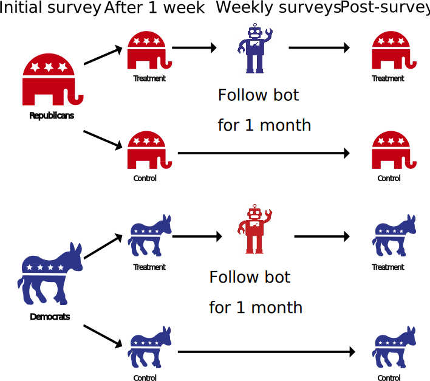

```{r xaringan-themer, include=FALSE, warning=FALSE}
# #This block contains the theme configuration for the CSS lab slides style
library(xaringanthemer) #
library(showtext)
style_mono_accent(
  base_color = "#1f5c99",
  text_font_size = "1.5rem",
  header_font_google = google_font("Raleway"),#("Yanone Kaffeesatz"),
  text_font_google   = google_font("Arial", "300", "300i"),
  code_font_google   = google_font("Fira Mono")
)
```

```{r setup, include=FALSE}
options(htmltools.dir.version = FALSE)
```

layout: true

---
class: inverse, center, middle, title-slide
background-image: url(figures/brain.png)
background-size: contain

# The Role of Emotions in Digital Communication
## Research lecture for the Assistant Professor Position on *Digital Technologies and Psychology*
### Mag. Dr. Hannah Metzler
### 09.09.2021 - University of Graz

---
layout: true
<div class="my-footer"><span>
<a href="https://psyarxiv.com/t8mhw"> Metzler et al. Psyarxiv (2020) - </a>
<a href="https://rdcu.be/8Gx5"> Chadwick*, Metzler* et al. Motivation & Emotion (2019) - </a>
<a href="https://peerj.com/articles/6726"> Metzler & Grèzes. PeerJ (2019)</a>
</span></div>

---

# Emotions in non-verbal social interaction

.left-column[
<br>

Emotions
- attract attention

- direct attention & behavior

]


.right-column[.center-right[
```{r, echo=FALSE, out.width=700}
knitr::include_graphics("figures/nonverbal.jpg")
```
]]

---
layout: true

---

# Emotions in digital communication

.left-column[
**Social media...**

**Tool**

<br>
**Effects**

<br>
**Environment**
]
--
<br>
.right-column[

* Digital traces of collective emotions during COVID-19
* Validity of social media emotion & sentiment measures <br> <br>
* Effects of social media content on mental health
    - suicidal & help seeking behavior <br> <br>
* Behavior on social media: <br>
Misinformation spreading & advocacy for societal causes 
]


???
tool that allows measuring things that we could not measure otherwise
Macroscopes: emotion measures at the level of populations

---
layout: true
<div class="my-footer"><span>
<a href="https://psyarxiv.com/qejxv"> Collective Emotions During the COVID-19 Outbreak. Metzler, Rimé, Pellert, Niederkrotenthaler, Di Natale & Garcia. Psyarxiv (2021)</a></span></div>

---

# Collective emotions during COVID-19

.pull-left[
**Social media data**
* Emotional expressions on Twitter
* 5 weeks after outbreak in 2020
* 8,3 billion tweets in 6 languages
* Geolocation: 18 countries

**Computational Methods**
* Automated text-analysis
* Validated emotion dictionaries
* Robustness: Machine Learning
* GLMEMs
]

.pull-right[

```{r, echo=FALSE, out.width=600}
knitr::include_graphics("figures/EmotionTimelines2020_Italy.svg")
```
]


???

ML: Deep learning: RoBERTa fine-tuned to tweets
Generalized Linear Mixed Effect Models
After image: link to stringency and cases in plot: association with real world events

---

# Measure stringency & COVID cases

.pull-left[.center-left[
```{r, echo=FALSE, out.width=460}
knitr::include_graphics("figures/stringency_periods.svg")
```
]]

.pull-right[.center-right[
```{r, echo=FALSE, out.width=400}
knitr::include_graphics("figures/correlation_anx_cases_week1.svg")
```
]]

---
layout: true
<div class="my-footer"><span>
<a href=https://arxiv.org/abs/2107.13236> Garcia, Pellert, Lasser, Metzler. arXiv (2021) - </a>
<a href=https://arxiv.org/abs/2108.07646> Pellert, Metzler, Matzenberger & Garcia. arXiv (2021) </a></span></div>

---

# Validity of emotion & sentiment measures

.pull-left[.center-left[
* 2 year period

* UK Twitter data
* YouGov: Weekly representative UK emotion survey

* Automated text-analysis & Machine Learning
* Pre-registered hypotheses for prediction period
]]
.pull-right[.center-right[
```{r, echo=FALSE, out.width=650, fig.align='right'}
knitr::include_graphics("figures/Anxiety.svg")
```

```{r, echo=FALSE, out.width=650, fig.align='right'}
knitr::include_graphics("figures/Sadness.svg")
```
]]

* Sentiment analysis in Austria: similar results

---
layout: true

---

# Media effects research on suicide

News reporting on suicide influences suicidal behavior in individuals at risk

.pull-left[.center-left[
```{r, echo=FALSE, out.width=250, fig.align='center'}
knitr::include_graphics("figures/Werther.png")
```

<div style="text-align:center">
Reports on suicide deaths: <br>
<span style="font-weight: bold; color:#1f5c99"> Werther</span> effect <br>
<font size="4">
<a href='https://www.bmj.com/content/368/bmj.m575'> Meta-analysis: Niederkrotenthaler et al. 2020 </a>
</font> </div>

]]

.pull-right[.center-right[

```{r, echo=FALSE, out.width=200, fig.align='center'}
knitr::include_graphics("figures/Papageno.png")
```

<div style="text-align:center">
Stories of hope & coping: <br> 
<span style="font-weight: bold; color:#1f5c99"> Papageno</span> effect  <br> 
<font size="4">
<a href='https://www.doi.org/10.1192/bjp.bp.109.074633'> (e.g. ) Niederkrotenthaler et al. 2010 </a>
</font> </div>
]]

<div style="text-align:center; font-weight: bold; color:#1f5c99"> Content and language matter </div>

---
layout: true
<div class="my-footer"><span> 
A Machine Learning approach to media effects research on suicide. Metzler, Baginski, Niederkrotenthaler & Garcia (in prep.) </span></div>

---

# Machine Learning classification of harmful & protective content

.pull-left[
* Social media content on suicide
* Big data for robust results
* 14.5 million US tweets 2013-2020
]
--
.pull-right[
* Scheme: typical content categories
* Leverage Artificial Intelligence:
Traditional ML & Deep Learning
]

--
```{r, echo=FALSE, out.width=1000, fig.align='center'}
knitr::include_graphics("figures/MLresults_per_category.svg")
```


???
Social media: young adults and new content types, but few studies
Small datasets with manual labelling: Big data
Best performance with BERT
Different metrics related to how many false positives and false negative errors the model makes, that I will explain more in the teaching lecture

---
layout: true
<div class="my-footer"><span> 
 Niederkrotenthaler, Tran, Baginski,..., & Metzler (in prep.) </span></div>

---

# Associations with suicides & helpline calls

Time series analyses of volume per tweet category with suicide cases & calls

```{r, echo=FALSE, out.width=900, fig.align='center'}
knitr::include_graphics("figures/CopingPreventionTweets.png")
```

* Coping stories: protective association with calls, but are rare
* Prevention tweets: protective association with cases & calls
* Suicide cases in general: no association 
<span style="font-size: 18px"><a href='https://www.doi.org/10.1192/bjp.bp.109.074633'> (confirming Niederkrotenthaler et al. 2020)</span> 

---
layout:true

---

# My research vision for Graz

**Investigate the role of emotion on social media** 
.left-column[
```{r, echo=FALSE, out.width=70}
knitr::include_graphics("figures/Papageno_noframe.svg")
```

```{r, echo=FALSE, out.width=90}
knitr::include_graphics("figures/corruption-2727571_1280.png")
```

```{r, echo=FALSE, out.width=80}

```
]

.right-column[.center-right[

...for protective and harmful effects on suicide

<br>
...in spreading of misinformation

<br>
...in spreading of evidence-based advocacy efforts
]]

<br><br>

**Develop digital interventions that consider emotions**


???

Misinfo: mention WWTF funding and 1 student + research assistant that will work with me in next 3 years 

---

# Emotion & Misinformation Spreading

.left-column[
```{r, echo=FALSE, out.width=350, fig.align='center'}
knitr::include_graphics("figures/factchecking.jpeg")
```

<br> <br> <br> <br> 

```{r, echo=FALSE, out.width=110, fig.align='left'}

```
<span style="font-size: 17px">Digital Humanism Grant</span> 
]

.right-column[
* Fake news and conspiracies increase during crisis
* Current interventions focus on accuracy <br><br>
]


```{r, echo=FALSE, out.width=850, fig.align='left'}

```


---

# Role of emotion in suicide prevention 

* No effect:  Oregon Media Project: Suicide Prevention Campaign

* Protective: 1-800-273-8255 song by Logic

```{r, echo=FALSE, out.width=400, fig.align='center'}

```

.pull-left[
```{r, echo=FALSE, out.width=500}
knitr::include_graphics("figures/expressed_experienced.svg")
```
]

<div style="font-size:22px"; color:gray; font-style: italic>
.pull-right[
* News: Inspector in Philadelphia Collapse Commits Suicide
* Sometimes, the ONLY thing that kept me from suicide was my dad and my love for myself that i had to find.
]
</div>

---
layout:true

---

# My collaboration network


```{r, echo=FALSE, out.width=1000, fig.align='left'}
knitr::include_graphics("figures/collaboration.svg")
```

???

Connect Uni Graz to my national & international collaboration partners, including psychologists, neuroscientists, computer and data scientists

---


# Summary: Social Media & Emotions
<top> 
.left-column[
<br>
**As a tool**
<br> <br> <br><br> <br> 
**Effects of media content**
<br> <br> <br>
**As an environment**
]

.right-column[
* Frequent & historical data
* Interactions between people: collective emotions
* Validity as emotion macropscopes
* Nonintrusive: no memory or reporting biases <br><br>
* Emotional connotation & response crucial <br>for suicide prevention
* Machine Learning for large-scale analyses <br><br>
* Information spreading
* Emotional algorithms
]
 </top>

---

# Thank you!

<br>

For more on my research: https://hannahmetzler.eu

For data and code: https://github.com/hannahmetzler

<br><br>

```{r, echo=FALSE, out.width=220}
knitr::include_graphics("figures/csh.png")
```
```{r, echo=FALSE, out.width=220}
knitr::include_graphics("figures/Meduni-wien.svg")
```
```{r, echo=FALSE, out.width=300}
knitr::include_graphics("figures/wwtf.svg")
```
```{r, echo=FALSE, out.width=260}
knitr::include_graphics("figures/vibrant.svg")
```


---
class: inverse, center, middle, title-slide
background-image: url(figures/brain.png)
background-size: contain

# Teaching Concept

### Teaching at the Interface of Psychology & Computer Science <br> <br> in the Master of Computational Social Systems

### Mag. Dr. Hannah Metzler


---

## Teaching philosophy & approach

.pull-left[.center-left[
- Active & goal-oriented learning

- Linking theory & research practice

- Critical thinking: 
    - probabilistic nature & robustness of evidence 
    - study design & methods 
    - good research practices
    
- Encourage participation

- Regular feedback: growth mindset
]]

.pull-right[.center-right[
```{r, echo=FALSE, out.width=120}
knitr::include_graphics("figures/communication-network.png")

```
```{r, echo=FALSE, out.width=80}

```
```{r, echo=FALSE, out.width=75}
knitr::include_graphics("figures/reddit.png")
```

<br>

```{r, echo=FALSE, out.width=100}
knitr::include_graphics("figures/bayesian-2889576_1280.png")
```
```{r, echo=FALSE, out.width=150}

knitr::include_graphics("figures/GitHub-Logo.svg")
```

<br>
```{r, echo=FALSE, out.width=150, fig.align='center'}

```
]]


???
Active learning: exerices applying theory to practice
When teaching psychology, critical reflection particularly necessary
reflect on the social impact of research?
Taking the student perspective to ensure motivation
Regular feedback for students: interleaved learning/repeated exams
Groth mindset for me and students: adapt teaching and foster motivation

---

# Courses in the CSS Master

* VU: Introduction to Psychology I & II
    - **Teaching activities and syllabus**

* SE: Emotional and social influences on digital communication on social media
    - **Introduction to Computational Social Psychology as teaching lecture**

* SE: A practical introduction to digital open research in social psychology 

???

focus on good research practices for digital research

---

# Introduction to Psychology I & II

1. Lectures on core areas of psychology
2. Exercises: Study idea on a lecture topic with digital tools/data
3. Interactive sessions with short presentations
    - Feedback on exercises & presentations

.left-column[
```{r, echo=FALSE, out.width=180}
knitr::include_graphics("figures/pen.png")
```
]
.right-column[
**Evaluation scheme**
- Intermediate exam 1 & 2: 35%
- Final exam: 25%
- Written exercises: 20%
- Group presentation & discussions: 20%

]

???

8 lectures, 4-5 interactive sessions
Knowledge: Describe the main areas of psychology and their core research topics
Exercise as homework: link theory/research practice, active learning: How would you investigate one of the topics from the previous session with CSS methods, digital data or on digital platforms? Describe a research question and method for a study in 250-500 words (on Moodle)
Interactive session: 6 students present their idea in 5 minutes (no slides necessary) + 10 min discussion 

Evaluation Designed to encourage
* interleaved learning
* active participation
* independent thinking
* application of psychological theories to digital studies
an interleaved curriculum works on the basis that different topics are woven together, switched between and revisited at intervals throughout the year.


---

# Syllabus

.pull-left[.center-left[
**I) History, Biology, Cognition, Development**
- Introduction & history
- Biological & neural processes
- Attention & perception
```{r, echo=FALSE, out.width=30}
knitr::include_graphics("figures/write.svg")

``` 
- Learning & memory
```{r, echo=FALSE, out.width=30}
knitr::include_graphics("figures/write.svg")

```
- Cognitive biases & decision making
```{r, echo=FALSE, out.width=30}
knitr::include_graphics("figures/write.svg")

```
- Language, thought & intelligence
```{r, echo=FALSE, out.width=30}
knitr::include_graphics("figures/write.svg")

```
- Development
```{r, echo=FALSE, out.width=30}
knitr::include_graphics("figures/write.svg")

```
]]

.pull-right[.center-right[
**II) Methods, Personality, Social, Gender, Clinical & Health**
- Social Science Methods
- Reproducibility & Open Science
- Personality & Interindividual Differences 
```{r, echo=FALSE, out.width=30}
knitr::include_graphics("figures/write.svg")

```
- Social Psychology 1 & 2
```{r, echo=FALSE, out.width=30}
knitr::include_graphics("figures/write.svg")

```
- Emotion & Motivation
```{r, echo=FALSE, out.width=30}
knitr::include_graphics("figures/write.svg")

```
- Gender & Sexual Behavior
```{r, echo=FALSE, out.width=30}
knitr::include_graphics("figures/write.svg")

```
- Clinical & Health Psychology
```{r, echo=FALSE, out.width=30}
knitr::include_graphics("figures/write.svg")

```
]]

???
Attention SENSATION and perception
Methods: (Design, statistics (NHST, Bayesian)
Social psych:
1) (Social Cognition, Perception, Attitudes, Self-understanding, Persuasion), 
2) (Relationships and attraction, Group processes, conformity, prosocial behavior & cooperation, aggression, prejudice, stereotyping, discrimination …)

---
class: inverse, center, top, title-slide

```{r, echo = FALSE}
# <!-- background-image: url(figures/communication-network.png) -->
# <!-- background-size: contain -->
```

# An Introduction to Computational Social Psychology

```{r, echo=FALSE, out.width=400}
knitr::include_graphics("figures/communication-network.png")
```

### Teaching Lecture on *Digitial Technologies and Psychology* <br> Hannah Metzler

---


# Computational Social Science (CSS)

<div style="text-align:center"><span style="font-weight: bold; color:#1f5c99">
Quantitative testing theories from the social sciences at unprecedented
breadth and depth and scale.</span> 
<span style="font-size: 22px; font-color: gray"> Lazer et al. Science (2009) </span> </div>


* New data sources (e.g. the Web and Social Media)

* New methods (e.g. Machine Learning, Simulation)

* Breadth: quantifying many things at the same time

* Depth: measuring a lot about each person

* Scale: gathering data on many people

<div style="text-align:center; font-weight: bold; color:#1f5c99"> “More is different” (Anderson, 1972) </div>

---

# Interdisciplinarity in CSS 

.pull-left[.center-left[
```{r, echo=FALSE, out.width=950}
knitr::include_graphics("figures/CSSoverview.svg")
```

]]
--
.pull-right[
### Psychology in the digital age

* Behavioral changes: 
    - online & offline
* New digital tools for 
    * teaching & learning
    * working 
    * diagnosis & therapy
* New computational methods
* New data sources
]

---

# Computational Social Psychology 

### Core topics & course overview

.pull-left[.center-left[

**Social media data analysis**
* Natural Language Processing
* Machine Learning
* Validity of emotion measures 

**Emotions & social media**
* Emotion regulation
* Social media and wellbeing
* Media effects on suicide
* Depression & Anxiety
]]

--

.pull-right[.center-right[
**Interaction on social media**
* Misinformation
* Collective emotions
* Polarization
* Outgroup hate
* Racial harrassement
]]
--
**=>Machine Learning** <br>

**=>Polarization**

---

# Machine Learning for text analysis

.pull-left[.center-left[
**Preprocessing** 
* Lower-casing
* Remove punctuation
* Stemming
* Lemmatization
* Replace URLs & users
* Tokens
]]
.pull-right[.center-right[
**Text representations**
* Word frequencies
    * Bag of words
    * Term Frequency-Inverse Document Frequency
* Word embeddings
]]
  
  
???
TF-IDF: Special weight to words that distinguish this type of text
---

# Types of models

* Linear regression
* Support-Vector-Machines
* Random Forest
...

---

## Neural networks = Deep learning

* Learn sentence structure and semantics from large text corpora

* Transfer learning: Retrain state-of-the art language models for specific tasks

* BERT: Masked word prediction & next sentence prediction <span style="font-size: 22px; font-color: gray"> Devlin et al. (2019) </span> 
    * “New **[MASK]** is a city” 
    * 15% of words masked: “[MASK] **[MASK]** is a city, in which ...”
    
* XLNET: Permutations of all words used to predict masked word <span style="font-size: 22px; font-color: gray"> Yang et al. (2019) </span> 

---

# Model training & evaluation

```{r, echo=FALSE, out.width=600}
knitr::include_graphics("figures/MLTraining.svg")
```

---

# Evaluation metrics 

* **Accuracy**: How many are correct?

* **Precision**: 
    * How many of the “positive” predictions are correct? 
    * How many predicted angry tweets are actually angry?
    
* **Recall**: 
    * How many of all the “true” instances does the model detec? 
    * How many of the actually angry tweets?
    
* **F1-Score**: weighted balance of P & R

---

# A field experiment on polarization

.pull-left[
* Differences between groups becoming more extreme

* Echo chambers on social media? 
]
--
.pull-right[
```{r, echo=FALSE, out.width=600}

```
]
---

# Backfire effect

```{r, echo=FALSE, out.width=900, fig.align='center'}

```


???

Material for other slides: 

Digital Technologies and Psychology

**Social Media**
E-Therapy
Videogames 
Serious Games 
Virtual Reality & Augmented Reality
Artificial Intelligence and Robotics 
Digital Learning
Blended Teaching
Digital Tools
Human-Computer Interaction
Brain-Computer interfaces
Experience Sampling

???
vent-diagram

Next slide: 
Topics in Computational Social Psychology

Topics: misinformation, hate speech, cyber-bullying, polarization, social interaction, social contagion, problematic and positive use of technology, additive behavior, mental health,  telework

???
zoom into social media in illustration from previous slide


Slide on types of digital research:
1) Observation
* Online data: behavior in digital environments
* Digital data created by devices in the physical world (supermarkets, phones)
* Government records (health, unemployment...)

2) Experimentation
* Online experiments: on social media or via surveys
* Crowdsourcing (Mechanical Turk)
* Research with digital technologies: neuroimaging, virtual reality, serious games...

3) Asking questions
* Online surveys

4) Mass collaboration

