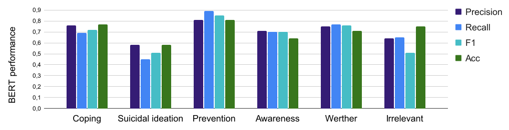
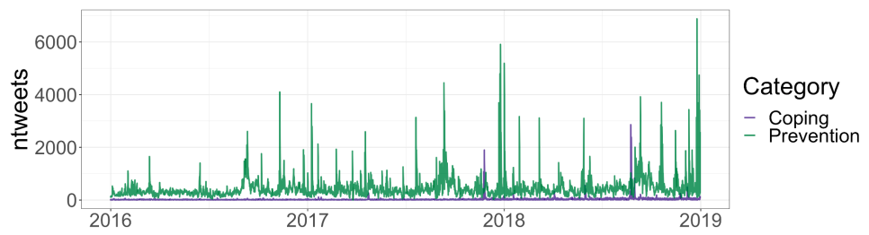
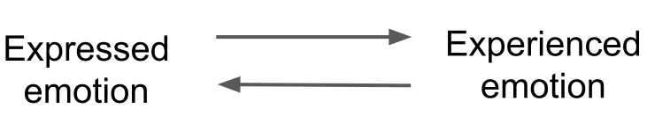
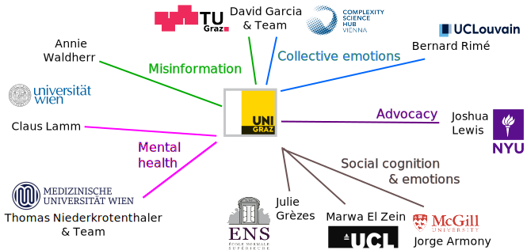
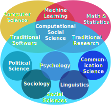
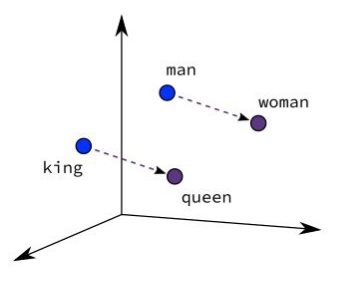
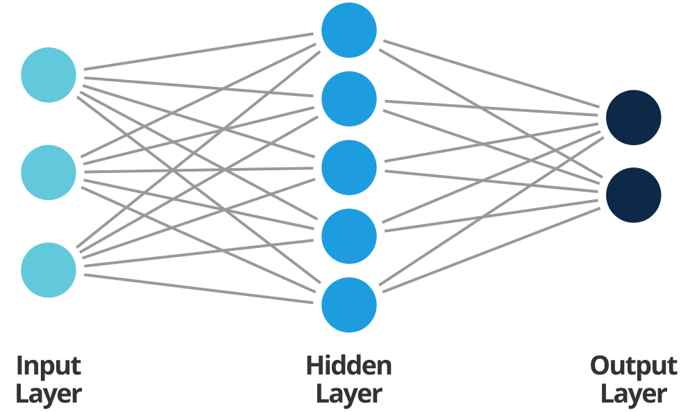
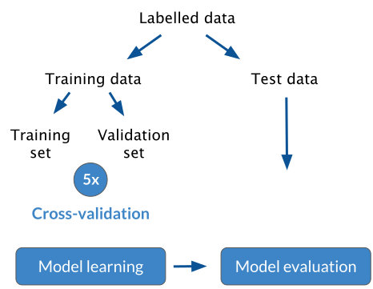

```{r xaringan-themer, include=FALSE, warning=FALSE}
# #This block contains the theme configuration for the CSS lab slides style
library(xaringanthemer) #
library(showtext)
style_mono_accent(
  base_color = "#1f5c99",
  text_font_size = "1.5rem",
  header_font_google = google_font("Raleway"),#("Yanone Kaffeesatz"),
  text_font_google   = google_font("Arial", "300", "300i"),
  code_font_google   = google_font("Fira Mono")
)
```

```{r setup, include=FALSE}
options(htmltools.dir.version = FALSE)
```

layout: true

---
class: inverse, center, middle, title-slide
background-image: url(figures/brain.png)
background-size: contain

# The Role of Emotions in Digital Communication
### Research lecture for the Assistant Professor Position on <br> *Digital Technologies and Psychology*
### Mag. Dr. Hannah Metzler
### 09.09.2021 - University of Graz
#### Slides: www.hannahmetzler.eu/APGraz


---
layout: true
<div class="my-footer"><span>
<a href="https://psyarxiv.com/t8mhw"> Metzler et al. Psyarxiv (2020) - </a>
<a href="https://rdcu.be/8Gx5"> Chadwick*, Metzler* et al. Motivation & Emotion (2019) - </a>
<a href="https://peerj.com/articles/6726"> Metzler & Grèzes. PeerJ (2019)</a>
</span></div>

---

# Emotions in non-verbal social interaction

.right-column[.center-right[
```{r, echo=FALSE, out.width=700}
knitr::include_graphics("figures/nonverbal.jpg")
```
]]

--

.left-column[
**Emotions**
- attract & direct attention

- affect behavior

<br>

Open Science!
]


---
layout: true

---

# Computational approach to emotions

### Social media...
```{r, echo=FALSE, out.width=1000, fig.align='center'}

```

???
mention the word complexity, link to collibri in Graz
tool that allows measuring things that we could not measure otherwise
Macroscopes: emotion measures at the level of populations

---

# Computational approach to emotions

### Social media as a data source
```{r, echo=FALSE, out.width=1000, fig.align='center'}

```

---
layout: true
<div class="my-footer"><span>
<a href="https://psyarxiv.com/qejxv"> Collective Emotions During the COVID-19 Outbreak. Metzler, Rimé, Pellert, Niederkrotenthaler, Di Natale & Garcia. Psyarxiv (2021)</a></span></div>

---

# Collective emotions during COVID-19

.pull-left[
**Social media data**
* Emotional expressions on Twitter
* 5 weeks after outbreak in 2020
* 8,3 billion tweets in 6 languages
* Geolocation: 18 countries

**Computational Methods**
* Automated text-analysis
* Validated emotion dictionaries
* Robustness: Machine Learning
* GLMEMs
]

.pull-right[

```{r, echo=FALSE, out.width=600}
knitr::include_graphics("figures/EmotionTimelines2020_Italy.svg")
```
]


???

ML: Deep learning: RoBERTa fine-tuned to tweets
Generalized Linear Mixed Effect Models
After image: link to stringency and cases in plot: association with real world events

---

# Measure stringency & COVID cases

.pull-left[.center-left[
```{r, echo=FALSE, out.width=460}
knitr::include_graphics("figures/stringency_periods.svg")
```
]]

.pull-right[.center-right[
```{r, echo=FALSE, out.width=400}
knitr::include_graphics("figures/correlation_anx_cases_week1.svg")
```
]]

---
layout: true
<div class="my-footer"><span>
<a href=https://arxiv.org/abs/2107.13236> Garcia, Pellert, Lasser, Metzler. arXiv (2021) - </a>
<a href=https://arxiv.org/abs/2108.07646> Pellert, Metzler, Matzenberger & Garcia. arXiv (2021) </a></span></div>

---

# Validity of emotion measures

.pull-left[.center-left[
* UK Twitter data
* YouGov: Weekly representative UK emotion survey
* 2 year period

* Automated text-analysis & Machine Learning
* Pre-registered hypotheses for prediction period
]]
.pull-right[.center-right[
```{r, echo=FALSE, out.width=650, fig.align='right'}
knitr::include_graphics("figures/Anxiety.svg")
```

```{r, echo=FALSE, out.width=650, fig.align='right'}
knitr::include_graphics("figures/Sadness.svg")
```
]]

* Sentiment analysis in Austria: similar results

???
Because the other research examples I want to present today are linked my research vision for Graz, I want to now give you an overview of the research I plan to do in the next years. 
---
layout: true

---

# My research vision for Graz

Investigate the role of **emotion** on social media 
--
.pull-left[.center-left[
```{r, echo=FALSE, out.width=350, fig.align='center'}

```
```{r, echo=FALSE, out.width=350, fig.align='center'}

```
]]

1) for **suicide prevention**

harmful & <br>
protective media effects
<br><br><br>
2) for **information spreading**

sharing & belief in misinformation  <br>
attention for evidence-based advocacy

--

<br>
Develop **digital interventions** that consider emotions

---

# Media effects research on suicide

News reporting on suicide influences suicidal behavior in individuals at risk

.pull-left[.center-left[
```{r, echo=FALSE, out.width=250, fig.align='center'}

```

<div style="text-align:center">
Reports on suicide deaths: <br>
<span style="font-weight: bold; color:#1f5c99"> Werther</span> effect <br>
<font size="4">
<a href='https://www.bmj.com/content/368/bmj.m575'> Meta-analysis: Niederkrotenthaler et al. 2020 </a>
</font> </div>

]]

.pull-right[.center-right[

```{r, echo=FALSE, out.width=200, fig.align='center'}
knitr::include_graphics("figures/Papageno.png")
```

<div style="text-align:center">
Stories of hope & coping: <br> 
<span style="font-weight: bold; color:#1f5c99"> Papageno</span> effect  <br> 
<font size="4">
<a href='https://www.doi.org/10.1192/bjp.bp.109.074633'> (e.g. ) Niederkrotenthaler et al. 2010 </a>
</font> </div>
]]

<div style="text-align:center; font-weight: bold; color:#1f5c99"> Content, language & emotional connotation matter </div>

---

# Computational approach to emotions
### Effects of social media

```{r, echo=FALSE, out.width=1000, fig.align='center'}

```

---
layout: true
<div class="my-footer"><span> 
A Machine Learning approach to media effects research on suicide. Metzler, Baginski, Niederkrotenthaler & Garcia (in prep.) </span></div>

---

# Machine Learning classification of harmful & protective content

.pull-left[
* Social media content on suicide
* Big data for robust results
* 14.5 million US tweets 2013-2020
]
--
.pull-right[
* Scheme: typical content categories
* Artificial Intelligence: <br>
Traditional ML & Deep Learning
]

--
```{r, echo=FALSE, out.width=1000, fig.align='center'}

```

???
Social media: young adults and new content types, but few studies
Small datasets with manual labelling: Big data
Best performance with BERTp

---
layout: true
<div class="my-footer"><span> 
 Niederkrotenthaler, Tran, Baginski,..., & Metzler (in prep.) </span></div>

---

# Associations with suicides & calls

* Daily volume of tweets per category: Time series in the US
```{r, echo=FALSE, out.width=830, fig.align='left'}

```

* Time series analysis with daily suicide cases & helpline calls
* Suicide cases in general: no association 
<span style="font-size: 18px"><a href='https://www.doi.org/10.1192/bjp.bp.109.074633'> (confirming Niederkrotenthaler et al. 2020) </a> </span>
* Coping stories: protective association with calls, but are rare
* Prevention tweets: protective association with cases & calls

---
layout:true

---

# Role of emotion in suicide prevention 

* No effect:  Oregon Media Project: Suicide Prevention Campaign

* Protective: 1-800-273-8255 song by Logic

```{r, echo=FALSE, out.width=400, fig.align='center'}
knitr::include_graphics("figures/sad&info.svg")
```

.pull-left[
```{r, echo=FALSE, out.width=500, fig.align='right'}

```
]

<div style="font-size:22px"; color:gray; font-style: italic>
.pull-right[
* News: Inspector in Philadelphia Collapse Commits Suicide

* Sometimes, the ONLY thing that kept me from suicide was my dad and my love for myself that i had to find.
]
</div>

---
layout:true

---


# Computational approach to emotions
### Social media as a system
```{r, echo=FALSE, out.width=1000, fig.align='center'}

```

---
# Emotional misinformation spreading

.left-column[
```{r, echo=FALSE, out.width=350, fig.align='center'}

```

<br> <br> <br><br> 

```{r, echo=FALSE, out.width=120, fig.align='left'}
knitr::include_graphics("figures/wwtf_notext.jpg")
```
<span style="font-size: 25px">PI of Digital Humanism project, 400k </span> 
]

.right-column[
* Current interventions focus on accuracy <br>
* Fake news and conspiracies increase during crisis
* Emotions increase sharing
]


```{r, echo=FALSE, out.width=850, fig.align='left'}
knitr::include_graphics("figures/Emomis.svg")
```

???

Mention here that this project gives me the resources for 2 PhD students + 1 assistant


---

# My collaboration network


```{r, echo=FALSE, out.width=1000, fig.align='left'}

```

???

Connect Uni Graz to my national & international collaboration partners, including psychologists, neuroscientists, computer and data scientists

These are excellent opportunities to apply to research grants

---


# Take-away: Social media & emotions
.left-column[
<br>
**Data source**
<br> <br> <br><br> <br> 
**Effects of media content**
<br> <br> <br>
**System**
]

.right-column[
* Interactions between people: collective emotions
* Frequent & historical data
* Validity as emotion macropscopes
* Nonintrusive: no memory or reporting biases <br><br>
* Emotional connotation & response crucial <br>for suicide prevention
* Machine Learning for robust large-scale analysis <br><br>
* Information spreading: fake news & protective information
* Modelling spreading & interventions in social networking platforms
]

---

# Thank you!

<br>

For more on my research: https://hannahmetzler.eu

For data and code: https://github.com/hannahmetzler

Slides: https://hannahmetzler.eu/APGraz/

<br>

```{r, echo=FALSE, out.width=220}
knitr::include_graphics("figures/csh.png")
```
```{r, echo=FALSE, out.width=220}
knitr::include_graphics("figures/Meduni-wien.svg")
```
```{r, echo=FALSE, out.width=300}
knitr::include_graphics("figures/wwtf.svg")
```
```{r, echo=FALSE, out.width=260}

```

---
class: inverse, center, middle, title-slide
background-image: url(figures/brain.png)
background-size: contain

# Teaching Concept

### Teaching at the Interface of Psychology & Computer Science <br> <br> in the Master of Computational Social Systems

### Mag. Dr. Hannah Metzler
#### Slides: www.hannahmetzler.eu/APGraz

---

# Contributions to the CSS Master
### Concept & example lecture

.left-column[
<br>
```{r, echo=FALSE, out.width=140, fig.align='center'}
knitr::include_graphics("figures/laptop.png")
```

<br>
```{r, echo=FALSE, out.width=120, fig.align='center'}
knitr::include_graphics("figures/psychology.png")
```
]

.right-column[
* **Teaching concept**
  
  * Introduction to Psychology I & II (Lecture + exercises) <br> <br>
  

* **Teaching lecture**
  
  * Introduction to Computational Social Psychology (Seminar)
  

]

---

## Teaching philosophy & approach

.pull-left[.center-left[
- Active & goal-oriented learning

- Linking theory & research practice

- Critical thinking: 
    - probabilistic nature & robustness of evidence 
    - study design & methods 
    - good research practices
    
- Encourage participation

- Regular feedback: growth mindset
]]

.pull-right[.center-right[
```{r, echo=FALSE, out.width=120}
knitr::include_graphics("figures/communication-network.png")
knitr::include_graphics("figures/logo-rond-twitter.svg")
```
```{r, echo=FALSE, out.width=80}
knitr::include_graphics("figures/Facebook_f_logo_(2019).svg")
```
```{r, echo=FALSE, out.width=75}

```

<br>

```{r, echo=FALSE, out.width=100}

```
```{r, echo=FALSE, out.width=150}
knitr::include_graphics("figures/osf.svg")

```

<br>
```{r, echo=FALSE, out.width=150, fig.align='center'}
knitr::include_graphics("figures/participate.svg")
```
]]


???
Empirically informed as psychologist
I have been working with computer science students, they need to be goal oriented, experience in mentoring at the Data Science master
Psychology students: theory focus, important to translate to practice
When teaching psychology, critical reflection particularly necessary
Taking the student perspective to ensure motivation
Regular feedback for students: interleaved learning/repeated exams
Growth mindset for me and students: adapt teaching and foster motivation

---
# Introduction to psychology I & II

1. Lectures on core areas of psychology
2. Exercises: Study idea on a lecture topic with digital tools/data
3. Interactive sessions with short presentations
    - Feedback on exercises & presentations

.left-column[
```{r, echo=FALSE, out.width=180}

```
]
.right-column[
**Evaluation scheme**
- Intermediate exam 1 & 2: 35%
- Final exam: 25%
- Written exercises: 20%
- Group presentation & discussions: 20%

]

???

8 lectures, 4-5 interactive sessions
Knowledge: Describe the main areas of psychology and their core research topics
Exercise as homework: link theory/research practice, active learning: How would you investigate one of the topics from the previous session with CSS methods, digital data or on digital platforms? Describe a research question and method for a study in 250-500 words (on Moodle)
Interactive session: 6 students present their idea in 5 minutes (no slides necessary) + 10 min discussion 

Evaluation Designed to encourage
* interleaved learning
* active participation
* independent thinking
* application of psychological theories to digital studies
an interleaved curriculum works on the basis that different topics are woven together, switched between and revisited at intervals throughout the year.


This translates to online teaching very well, I have experience supervising students online.
Book: Cognitive Psychology, mention the word cognitive psychology approach, cognitive psychology standpoint

---

# Syllabus

.pull-left[.center-left[
**I) Biology, Cognitive Psychology, Development**
- Introduction & history
- Biological & neural processes
- Attention & perception
```{r, echo=FALSE, out.width=30}

knitr::include_graphics("figures/speech-bubbles-orange.png")
``` 
- Learning & memory
```{r, echo=FALSE, out.width=30}

knitr::include_graphics("figures/speech-bubbles-orange.png")
```
- Cognitive biases & decision making
```{r, echo=FALSE, out.width=30}

knitr::include_graphics("figures/speech-bubbles-orange.png")
```
- Language, thought & intelligence
```{r, echo=FALSE, out.width=30}

knitr::include_graphics("figures/speech-bubbles-orange.png")
```
- Development
```{r, echo=FALSE, out.width=30}

knitr::include_graphics("figures/speech-bubbles-orange.png")
```
]]

.pull-right[.center-right[
**II) Methods, Personality, Social, Gender, Clinical & Health**
- Social Science Methods
- Reproducibility & Open Science
- Personality & Interindividual Differences 
```{r, echo=FALSE, out.width=30}

knitr::include_graphics("figures/speech-bubbles-orange.png")
```
- Social Psychology 1 & 2
```{r, echo=FALSE, out.width=30}

knitr::include_graphics("figures/speech-bubbles-orange.png")
```
- Emotion & Motivation
```{r, echo=FALSE, out.width=30}

knitr::include_graphics("figures/speech-bubbles-orange.png")
```
- Gender & Sexual Behavior
```{r, echo=FALSE, out.width=30}

knitr::include_graphics("figures/speech-bubbles-orange.png")
```
- Clinical & Health Psychology
```{r, echo=FALSE, out.width=30}

knitr::include_graphics("figures/speech-bubbles-orange.png")
```
]]

???
Attention SENSATION and perception
Methods: (Design, statistics, NHST, Bayesian)
Social psych:
1) (Social Cognition, Perception, Attitudes, Self-understanding, Persuasion), 
2) (Relationships and attraction, group processes, conformity, prosocial behavior & cooperation, aggression, prejudice, stereotyping, discrimination …)

---
class: inverse, center, top, title-slide

```{r, echo = FALSE}
# <!-- background-image: url(figures/communication-network.png) -->
# <!-- background-size: contain -->
```

### Teaching Lecture on Digital Technologies and Psychology 
##  An Introduction to Computational Social Psychology

```{r, echo=FALSE, out.width=400}
knitr::include_graphics("figures/communication-network.png")
```

### Mag. Dr. Hannah Metzler

---


# Computational Social Science (CSS)

<div style="text-align:center"><span style="font-weight: bold; color:#1f5c99">
Quantitative testing theories from the social sciences at unprecedented
breadth and depth and scale.</span> 
<span style="font-size: 22px; font-color: gray"> Lazer et al. Science (2009) </span> </div>


* New data sources (e.g. the Web and Social Media)

* New methods (e.g. Machine Learning, Simulation)

* Big data: 
    * quantifying many things at the same time
    * measuring a lot about each person
    * gathering data on many people

<div style="text-align:center; font-weight: bold; color:#1f5c99"> “More is different” (Anderson, 1972) </div>

---

# Interdisciplinarity in CSS 

.pull-left[.center-left[
```{r, echo=FALSE, out.width=950}

```
]]
--
.pull-right[
### Psychology in the digital age

* Behavioral changes: 
    - online & offline
* New digital tools for 
    * teaching & learning
    * working 
    * diagnosis & therapy
* New computational methods
* New data sources
]

---

# Computational Social Psychology

.pull-left[
**"Computational"**
* Social media data
* Social network analysis
* Natural Language Processing
* Machine Learning
* Validity of emotion measures 
]

--

.pull-right[
**"Social": Social media**
* Misinformation
* Collective emotions
* Polarization
* Hate speech
* Emotion regulation
* Social media effects on wellbeing
* Media effects on suicide
* Detecting depression & anxiety
]

--

**Basics for Machine Learning & psychological example**
---

# Machine Learning for text analysis

.pull-left[.center-left[
**Text representations**
* Word frequencies
    * Bag of words
    * Term Frequency-Inverse Document Frequency
    
* Word embeddings
```{r, echo=FALSE, out.width=250, fig.align='right'}

```
]]

--
.pull-right[.center-right[
**Classification algorithms**

Map representations to categories

* Regressions
* Support-Vector-Machines
* Random Forests
* **Neural networks**
]]

 
???
TF-IDF: Special weight to words that distinguish this type of text
Random Forest: decision tree tries to split by the variable that maximally separates groups in terms of variance, then the next variable with max variance. Multiple trees run on random bootstrapped subsets of data, with random set of variables and data points. Not dependent on any specific variable. 

**Preprocessing** 
* Lower-casing
* Remove punctuation
* Stemming
* Lemmatization
* Replace URLs & users
* Tokens

---

# Neural networks = Deep learning


.pull-left[
* Learn sentence structure and semantics from large text corpora

* BERT: 12 layers <span style="font-size: 22px; font-color: gray"> Devlin et al. (2019) </span> 
    * Masked word prediction
    * “New **[MASK]** is a city” 

* Input layer: Quantitative representation of sentence
* Output layer: One-hot encoding

]

.pull-right[
```{r, echo=FALSE, out.width=450}

```

]

???
One hot encoding: output has as many units as words in the dictionary, one has a maximum value which is the one we predict, mention that output layer is probabilities
Potato example
Input: one-hot times embedding, everything but the mask


    * 15% of words masked: “[MASK] **[MASK]** is a city, in which ...”
* XLNET: Permutations of all words used to predict masked word <span style="font-size: 22px; font-color: gray"> Yang et al. (2019) </span> 

---

# Model training & evaluation

```{r, echo=FALSE, out.width=600}

```

???
Prediction, not inference: conclusions we draw need to be valid for new data

---
layout: true
<div class="my-footer"><span> 
A Machine Learning approach to media effects research on suicide. Metzler, Baginski, Niederkrotenthaler & Garcia (in prep.) </span></div>

---


# Example: ML for Suicide Prevention

* Social contagion effect for suicidal behavior <span style="font-size: 18px"><a href='https://www.bmj.com/content/368/bmj.m575'> e.g. Niederkrotenthaler et al. (2020) </a> </span>
* Messages about suicide are associated with suicide cases & helpline calls
* Text characteristics matter: Classifying different types of tweets

```{r, echo=FALSE, out.width=900, fig.align='center'}
knitr::include_graphics("figures/suicide_tweets.png")
```


---

# Using ML for efficient large scale analysis

.pull-left[
* 14.5 million tweets

* Manual labelling of 3200 tweets

* Multiclass classification task: <br> 6 categories

* Comparing different methods: 
  * Word frequency
  * Deep learning
  * Best: BERT
]
.pull-right[
```{r, echo=FALSE, out.width=500, fig.align='center'}

```
]


---

# Evaluation metrics 

.left-column[
<br><br><br>
```{r, echo=FALSE, out.width=350}
knitr::include_graphics("figures/actual_vs_predicted.png")
```
]
.right-column[.center-right[
* **Accuracy**: Proportion of correct predictions

* **Precision**: $P = TP/(TP+FP)$
    * How many of the “positive” predictions are correct? 
    * How many predicted coping tweets are actual coping?
    
* **Recall**: $R = TP/(TP+FN)$
    * How many of “true” instances does the model get? 
    * How many of the actual coping tweets does it get?
    
* **F1-Score**: harmonic mean of precision & recall
]]
???

A model can have good precision and bad recall => F1

---

# Results: Performance per tweet category

```{r, echo=FALSE, out.width=1000, fig.align='center'}

```

* Irrelevant: Accuracy problematic
* Prevention: Model detects 90%
* Suicidal thoughts: Model misses many - sarcastic messages
* State-of-the art performance <span style="font-size: 18px"><a href='https://www.sciencedirect.com/science/article/pii/S2468696417300605'> Burnap et al. (2017) </a> </span>
* Next: Associations of 14 mio tweets with suicides & calls

---
layout: true

---

# Conclusion

* CSS as highly interdisciplinary field including psychology

* Digital technologies & social media: <br>
  * New opportunities for social psychological research

* Basics in Machine Learning for text analysis

* Machine Learning as a useful & effective tool for psychological research: Large-scale analysis


# Thank you for your attention!

???

Material for other slides: 

Digital Technologies and Psychology

Social Media
E-Therapy
Videogames 
Serious Games 
Virtual Reality & Augmented Reality
Artificial Intelligence and Robotics 
Digital Learning
Blended Teaching
Digital Tools
Human-Computer Interaction
Brain-Computer interfaces
Experience Sampling

Slide on types of digital research:
1) Observation
* Online data: behavior in digital environments
* Digital data created by devices in the physical world (supermarkets, phones)
* Government records (health, unemployment...)

2) Experimentation
* Online experiments: on social media or via surveys
* Crowdsourcing (Mechanical Turk)
* Research with digital technologies: neuroimaging, virtual reality, serious games...

3) Asking questions
* Online surveys

4) Mass collaboration